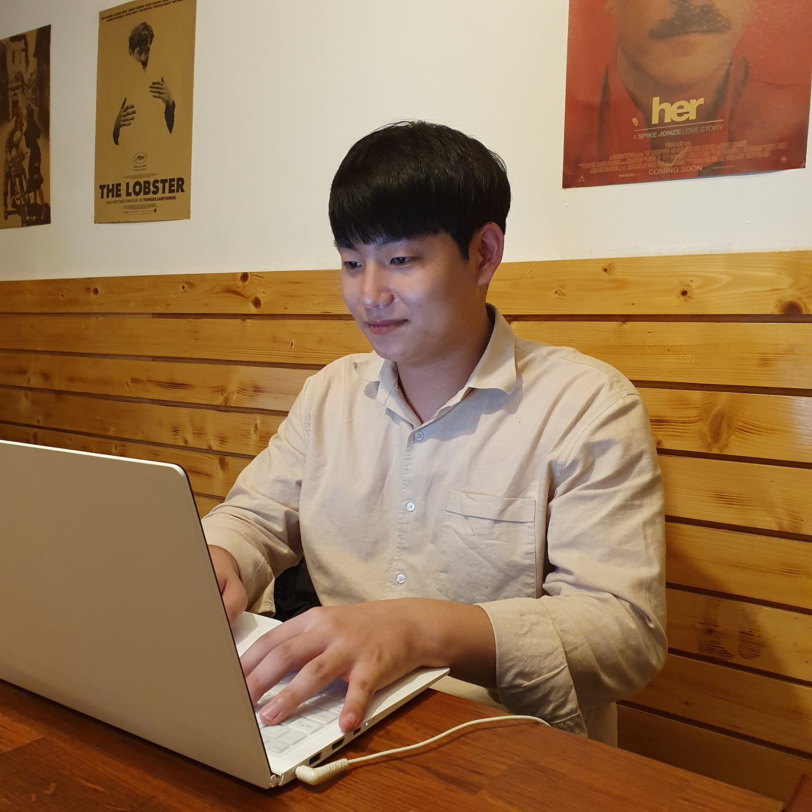

## 프로필

##### 이메일
hawoon206@kaist.ac.kr

##### 전화번호
010-4557-6485

##### 출생
1999.12.06

##### GitHUb 주소
https://github.com/Haun1206

 
 

## 학력사항

**2019.02~** 한국과학기술원(KAIST) 전산학부 재학

**2018.02**  한국과학기술원(KAIST) 입학

**2015.02**  경남과학고등학교 입학

 
 

## 수강 완료 과목 
이산 구조

데이터 구조

시스템 프로그래밍

전산기 조직

운영체제

프로그래밍 언어

기계학습

 
 

## 언어

**C**

**Python**

**Scala**

 
 

## 프로젝트

##### 몰입캠프 (2020.07.08 ~ 08.07)

단어장 어플 @ [week1](https://github.com/ohsuz/madcamp_week1_TabApp.git)
 
Tech Stack : Java(Android), PHP, MYSQL

게시판 어플 @ [week2](https://github.com/Haun1206/madcam_week2.git)
 
Tech Stack : Java(Android), NodeJs, MongoDB

마스크 인식 및 경고 알람 어플 @ [week3](https://github.com/jinh0290/MadCamp-week3.git)
 
Tech Stack : Java(Android), NodeJs, MongoDB, detection models(facemaskdetector, face_recognition)

2인용 전략 게임 @ [week4](https://github.com/sungjin-shin/madcamp2020s-week4.git)(현재 디렉토리 공유가 안되어 있음)
 
Tech Stack : C#(Unity)

